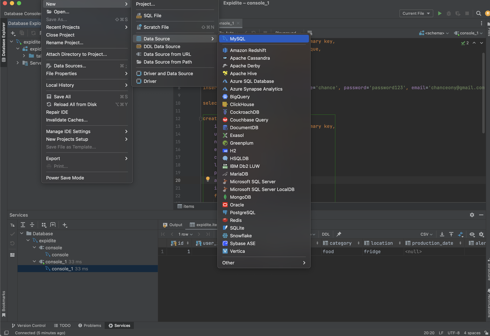
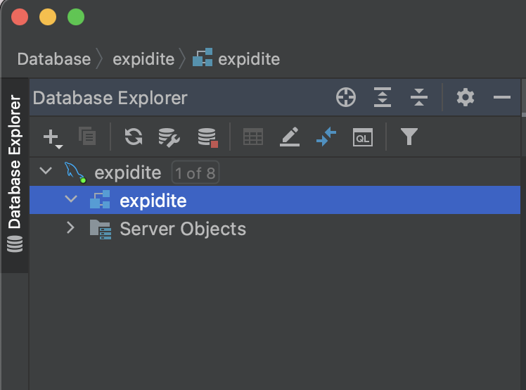
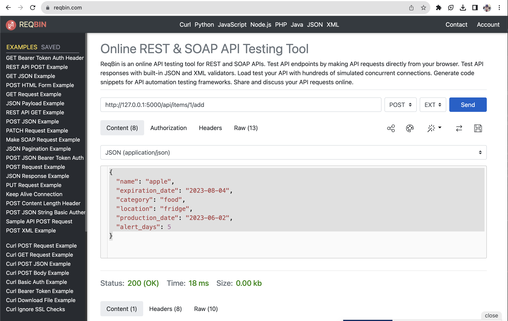
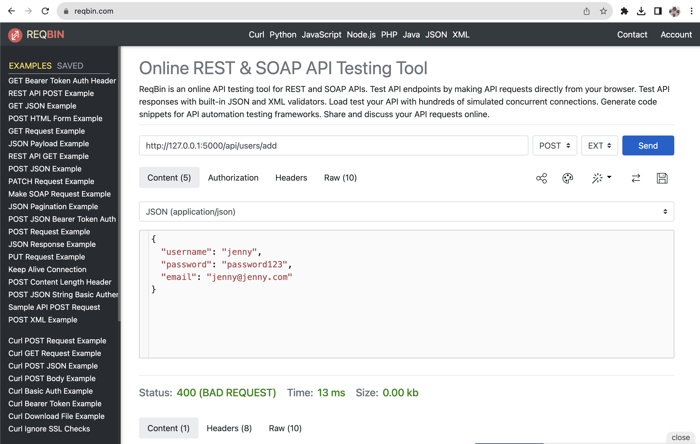

# Set Up MySQL database
1) Create Jetbrains account with student email: https://account.jetbrains.com/login

2) Download DataGrip from account

3) Install mysql:\
Make sure to use\
user: root\
password: password\
(We should all use the same user and password) \
https://dev.mysql.com/doc/mysql-getting-started/en/ 

4) In DataGrip, File -> New -> Project

5) File -> New -> Data source -> MySQL (Name: expidite, use user and password from last step). Make sure to test connection!



6) Right click expidite data source -> New -> Schema


7) Name it ‘expidite’ (you should get an error message after clicking OK). Now the expidite schema should show up underneath



8) Right click the schema, New -> Query console

9) Create users table, insert a new user, and print all the rows in the table: \
Paste into the new query console and hit run button to execute \
```
create table users (
    id int not null auto_increment primary key,
    username varchar(255) not null unique,
    password varchar(255) not null,
    email varchar(255) not null unique
);
```

```
insert into users set username='chance', password='password123', email='chanceony@gmail.com';
```

```
select * from expidite.users;
```

This should output the row you just created

10) Create items table, insert a new item, and print all the rows in the table:
```
create table items (
    id int not null auto_increment primary key,
    user_id int not null,
    name varchar(255) not null,
    expiration_date char(10) not null,
    category varchar(255),
    location varchar(255),
    production_date char(10),
    alert_days int,
    image longblob,
    foreign key (user_id)
        references users(id)
                   on update cascade
                   on delete cascade
);
```

```
insert into items set name='milk', expiration_date='2023-12-18', category='food', location='fridge', alert_days='10', user_id=1;
```

```
select * from expidite.items;
```

This should output the row you just created

Done with the database!


# Set Up flask-backend

### `. .venv/bin/activate`

Activates virtual environment


### `pip install Flask`

Installs Flask


### `pip install pymysql`

Installs python MySQL package

### `pip install flask_cors`

Installs python Flask CORS package


### `flask --app server run`

Runs file names server.py. Open the local host address in the console output and you should see "Hello, World!"


### use [ReqBin](https://reqbin.com/) (install extension) to test api routes that require json data
Example adding new item:\
route: http://127.0.0.1:5000/api/items/1/add \
method: POST
```
json:
{
  "name": "apple", 
  "expiration_date": "2023-08-04", 
  "category": "food", 
  "location": "fridge", 
  "production_date": "2023-06-02", 
  "alert_days": 5 
}
```
\



Example adding new user:\
route: http://127.0.0.1:5000/api/users/add \
method: POST
```
json:
{
  "username": "jordan", 
  "password": "password123", 
  "email": "jordan@gmail.com"
}
```
\
