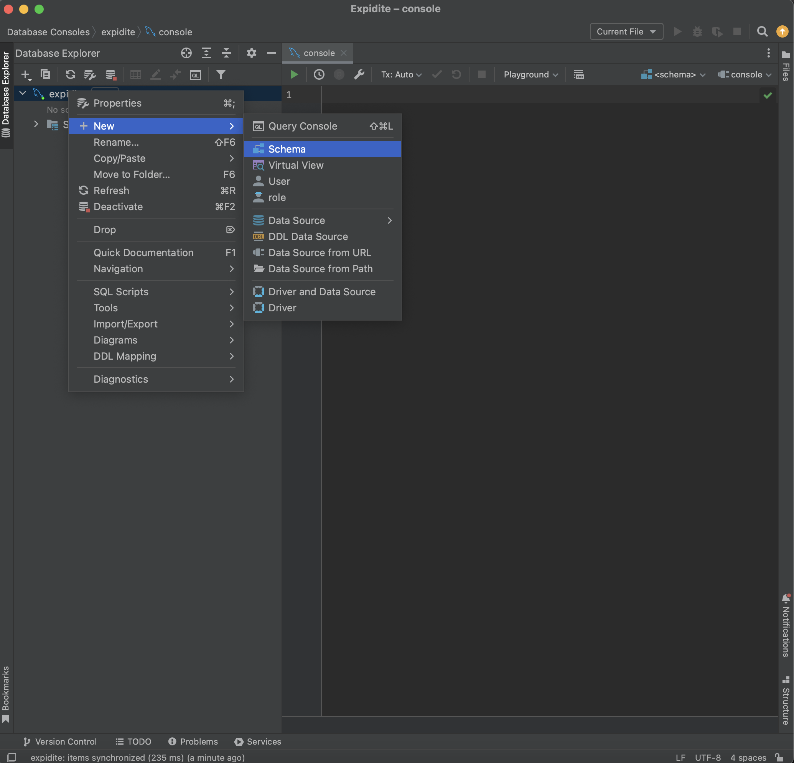
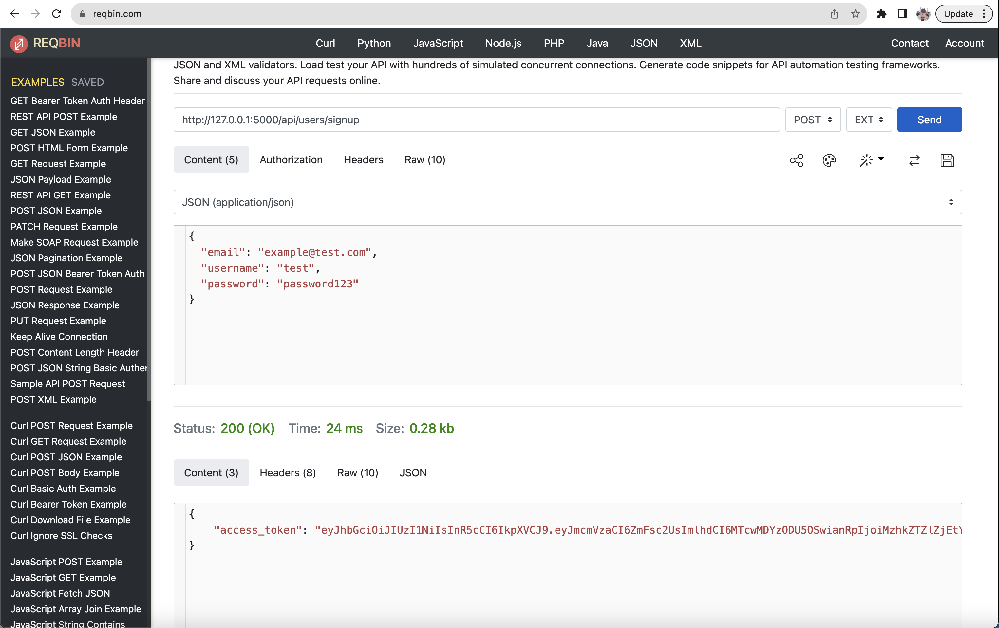
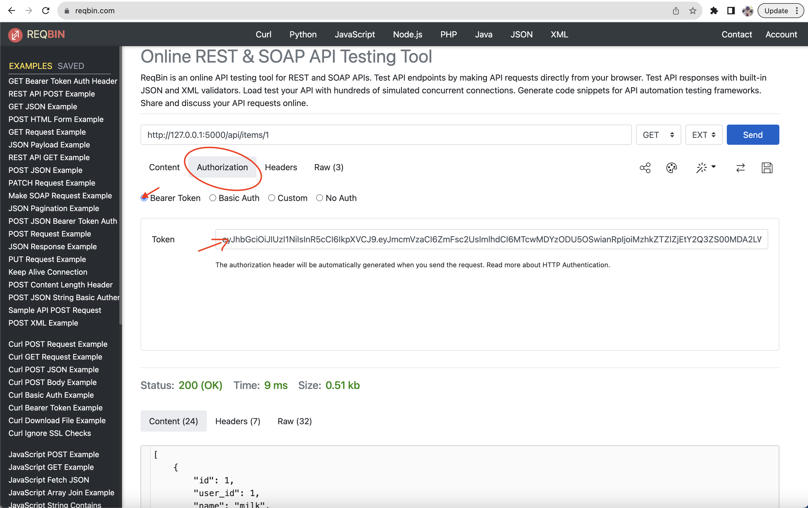
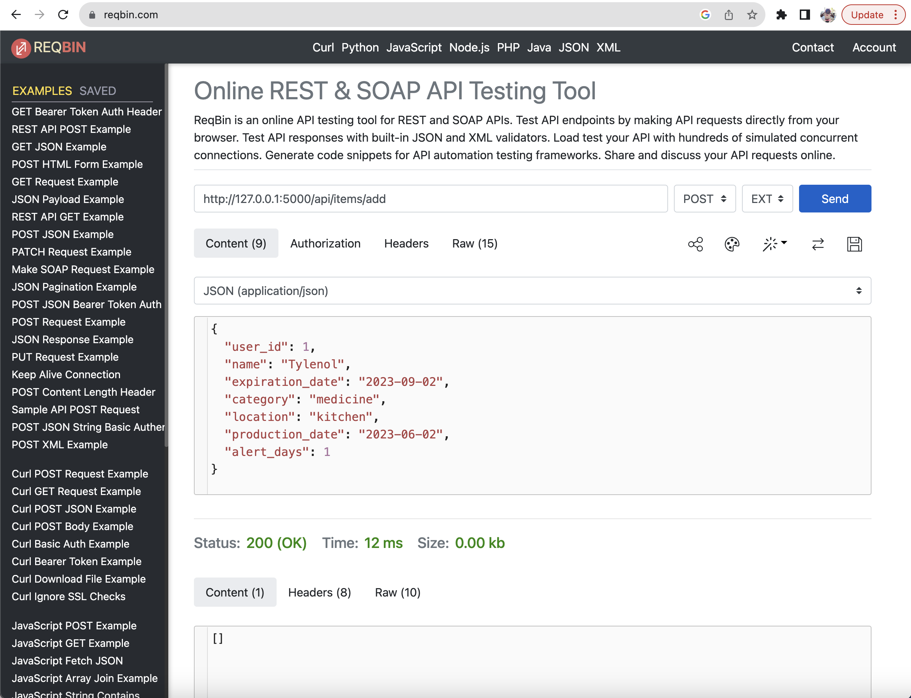
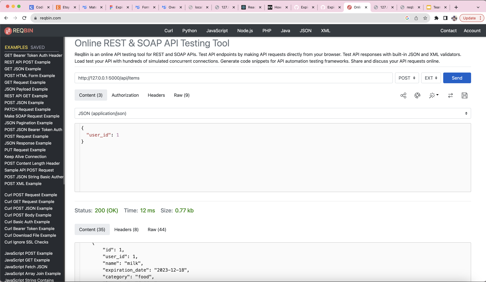

# Set Up MySQL database
1) Create Jetbrains account with student email: https://account.jetbrains.com/login

2) Download DataGrip from account

3) Install mysql:\
Make sure to use\
user: root\
password: password\
(We should all use the same user and password) \
https://dev.mysql.com/doc/mysql-getting-started/en/ 

4) In DataGrip, File -> New -> Project

5) File -> New -> Data source -> MySQL (Name: expidite, use user and password from last step). Make sure to test connection!


6) Right click expidite data source -> New -> Schema



7) Name it ‘expidite’ (you should get an error message after clicking OK). Now the expidite schema should show up underneath


8) Right click the schema, New -> Query console

9) Create users table, insert a new user, and print all the rows in the table: \
Paste into the new query console and hit run button to execute
```
create table expidite.users (
    id int not null auto_increment primary key,
    username varchar(255) not null unique,
    password varchar(255) not null,
    email varchar(255) not null unique
);
```

```
insert into expidite.users set username='chance', password='password123', email='chanceony@gmail.com';
```

```
select * from expidite.users;
```

This should output the row you just created

10) Create items table, insert a new item, and print all the rows in the table:
```
create table expidite.items (
    id int not null auto_increment primary key,
    user_id int not null,
    name varchar(255) not null,
    expiration_date char(10) not null,
    category varchar(255),
    location varchar(255),
    production_date char(10),
    alert_days int,
    image varchar(255),
    foreign key (user_id)
        references users(id)
                   on update cascade
                   on delete cascade
);
```

```
insert into expidite.items set name='milk', expiration_date='2023-12-18', category='food', location='fridge', alert_days='10', user_id=1;
```

```
select * from expidite.items;
```

This should output the row you just created

11) Create tables for categories and locations
```
create table expidite.categories (
    id int not null auto_increment primary key,
    user_id int not null,
    category varchar(255) not null,
    foreign key (user_id)
        references users(id)
                   on update cascade
                   on delete cascade
);
```

```
insert into expidite.categories set user_id=1, category='food';
insert into expidite.categories set user_id=1, category='medicine';
insert into expidite.categories set user_id=1, category='skincare';
```

```
select * from expidite.categories;
```

```
create table expidite.locations (
    id int not null auto_increment primary key,
    user_id int not null,
    location varchar(255) not null,
    foreign key (user_id)
        references users(id)
                   on update cascade
                   on delete cascade
);
```

```
insert into expidite.locations set user_id=1, location='kitchen';
insert into expidite.locations set user_id=1, location='pantry';
insert into expidite.locations set user_id=1, location='bathroom';
```

```
select * from expidite.locations;
```

Done with the database!


# Set Up flask-backend

### `. .venv/bin/activate`

Activates virtual environment


### `pip install Flask`

Installs Flask


### `pip install flask_jwt_extended`

Installs flask jwt for authenticating routes


### `pip install pymysql`

Installs python MySQL package

### `pip install flask_cors`

Installs python Flask CORS package


### `flask --app server run`

Runs file names server.py. Open the local host address in the console output and you should see "Hello, World!"


### use [ReqBin](https://reqbin.com/) (install extension) to test api routes that require json data

All routes except for the login and signup routes require an authentication access token.

First create an account using the signup api:


You should see the 'access_token' in the response on the bottom.

Once you have an account, you can just sign in passing the username and password in the json to the login api. This will also return the access_token.

To access other routes, paste this access token into the Bearer Token in Authorization tab:


Make a note of the id for the user returned.


Example adding new item: \
route: http://127.0.0.1:5000/api/items/add \
method: POST
```
json:
{
  "user_id": [your id returned when you signed up]
  "name": "apple", 
  "expiration_date": "2023-08-04", 
  "category": "food", 
  "location": "fridge", 
  "production_date": "2023-06-02", 
  "alert_days": 5 
}
```
\


Get all of your items:\
route: http://127.0.0.1:5000/api/items \
method: POST
```
json:
{
  "user_id": [your id returned when you signed up]
}
```
