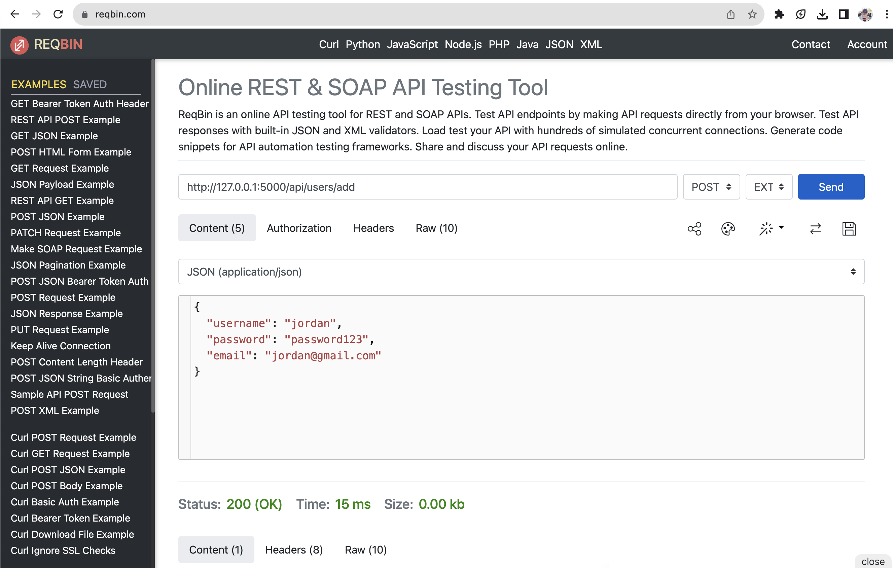

# flask-backend

### `. .venv/bin/activate`

Activates virtual environment

### `pip install Flask`

Installs Flask

### `pip install pymysql`

Installs python MySQL package

### `pip install flask_cors`

Installs python Flask CORS package

### `flask --app server run`

Runs file names server.py. Open the local host address in the console output and you should see "Hello, World!"

### use [ReqBin](https://reqbin.com/) (install extension) to test api routes that require json data
Example adding new item:\
route: http://127.0.0.1:5000/api/items/1/add \
method: POST\
json:\
{
  "name": "apple", \
  "expiration_date": "2023-08-04", \
  "category": "food", \
  "location": "fridge", \
  "production_date": "2023-06-02", \
  "alert_days": 5 \
}
\

Example adding new user:\
route: http://127.0.0.1:5000/api/users/add \
method: POST\
json:\
{
  "username": "jordan", \
  "password": "password123", \
  "email": "jordan@gmail.com" \
}
\
